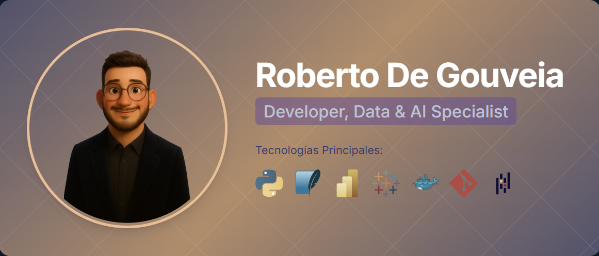

<!-- Encabezado animado -->

  

  
  

  

---

## 👋 Sobre Mí

¡Hola! Soy **Roberto De Gouveia**, desarrollador Full Stack y científico de datos. Me apasiona crear soluciones innovadoras que fusionen tecnología web moderna con análisis avanzado de datos y machine learning. Siempre en busca de nuevos retos y oportunidades para aprender y crecer 🚀

---

## 🚀 Tecnologías & Herramientas

  <!-- Web -->
  
  
  
  
  
  
  <!-- Data Science -->
  
  
  
  
  
  
  
  <!-- DB -->
  
  
  <!-- Other -->
  
  
  

---

## 💡 ¿Qué puedo hacer por ti?

- 💻 **Desarrollo Web** – Apps modernas y responsivas
- 🛢️ **Bases de Datos** – Optimización y seguridad
- 📊 **Data Science** – Insights accionables y visualización
- 🤖 **Machine Learning** – Modelos predictivos y automatización
- 🔧 **ETL & Preprocesamiento** – Limpieza y preparación de datos
- 📂 **DevOps & Git** – Integración y control profesional

---

## 🏆 Proyectos Destacados

### 📈 Data Science
- **[Bank Marketing Campaign Analysis](https://github.com/Skorpion02/Bank_campaing)** – Análisis predictivo de campañas bancarias
- **[Titanic Insights](https://github.com/Skorpion02/Titanic_Insights)** – Análisis de supervivencia del Titanic
- **[Car Evaluation](https://github.com/Skorpion02/Car_evaluation)** – Sistema de evaluación de automóviles
- **[UFO Insights](https://github.com/Skorpion02/UFO_Unveiling_Temporal_Patterns)** – Análisis temporal de avistamientos OVNI

### 💻 Desarrollo Web
- **Employee Clock-In System** – Sistema de control de horarios (En desarrollo)
- **Nova Clean** – Página web corporativa moderna (En desarrollo)
- **Stock Management System** – Gestión de inventario (En desarrollo)
- **[IMEI Lookup](https://github.com/Skorpion02/IMEIs-Lookup)** – Herramienta de consulta IMEI

### 🎮 Proyectos de Aprendizaje
- **[Slot Machine](https://github.com/Skorpion02/Machine_Slot)** – Máquina tragamonedas en Java
- **[Racing Game](https://github.com/Skorpion02/Racing_Game)** – Juego de carreras

---

## 📞 Contacto

  
  
  

---

## 💼 Experiencia

- **IT Subchief** – CMR ES  
  Gestión de infraestructura IT, optimización de sistemas y redes.
- **Aux Web Development** – Freelancer  
  Desarrollo de aplicaciones web personalizadas, mantenimiento y optimización.

---

## 🎓 Educación

- **Bachelor in Science** – High School
- **Web Development** – Udemy
- **Master Data Science & AI**

---

## 🛠️ Habilidades Técnicas

  
<b>Programming & Development</b>

  <ul>
    <li>CMD 🖥️, PowerShell 🖥️, Python 🐍</li>
  </ul>

  
<b>Data Analysis & Visualization</b>

  <ul>
    <li>Power BI 💡, Tableau 🎨, matplotlib 📉, seaborn 🌊</li>
  </ul>

  
<b>Networking & Security</b>

  <ul>
    <li>NAS systems 💾, pfSense firewalls 🔒</li>
  </ul>

  
<b>Operating Systems</b>

  <ul>
    <li>Windows OS 🪟, Linux 🐧</li>
  </ul>

  
<b>Version Control & Agile</b>

  <ul>
    <li>Git 🌳, Metodologías ágiles 🏃‍♂️</li>
  </ul>

---

## 📊 GitHub Stats

  
  

---

## 🚀 Tecnologías del Portfolio

Este portfolio está construido con:
- **HTML5** – Estructura semántica
- **CSS3** – Diseño moderno y responsivo
- **JavaScript** – Interactividad y animaciones
- **Bootstrap** – Framework CSS
- **GSAP** – Animaciones avanzadas
- **Swiper** – Sliders y carruseles

---

 ✨🚨 ¡HAZ CLIC AQUÍ! 🚨✨

  

  📱🌐 <b><a href="https://skorpion02.github.io/">Ver Portfolio</a></b>

---

  ⭐ <b>¡Dale una estrella si te gustó mi trabajo!</b> ⭐ 
  Desarrollado con ❤️ por Roberto De Gouveia

